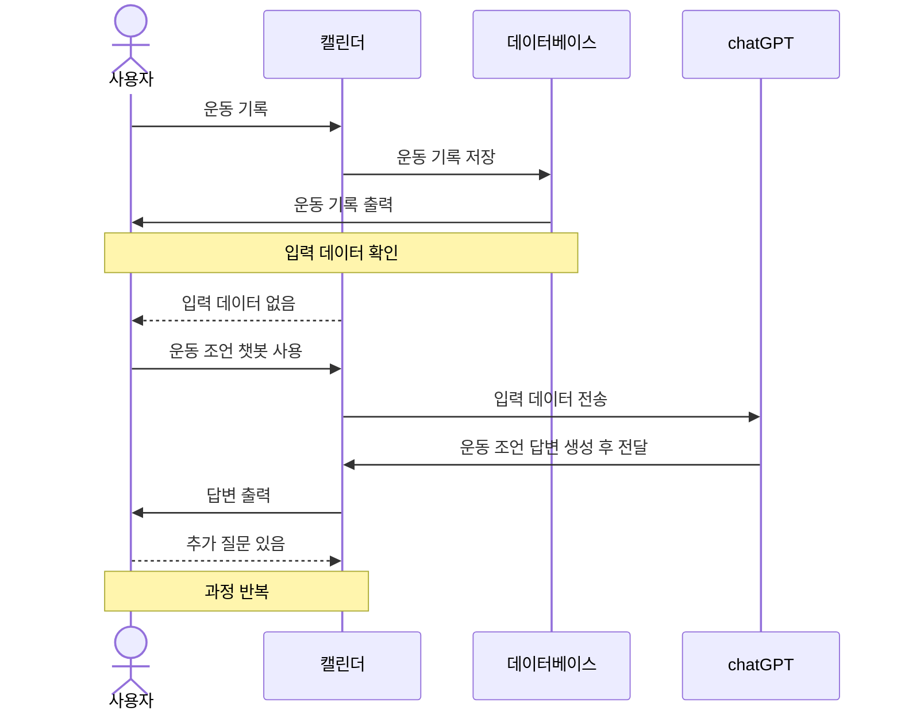
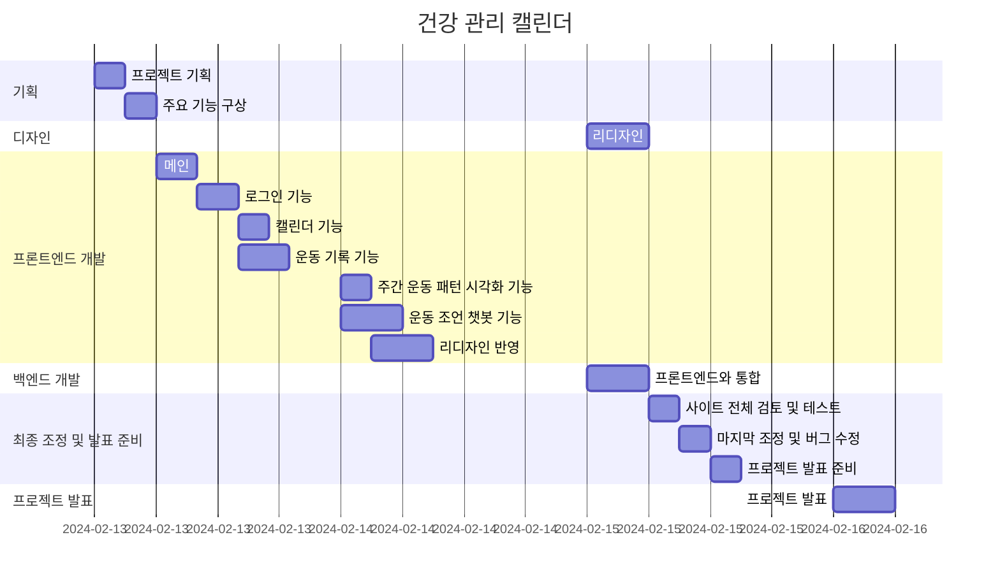

# 건강 관리 캘린더

## 1. 목표와 기능awd

### 1.1 목표awd

- 그날 했던 운동을 입력하여서 조언받는 캘린더

### 1.2 기능

- 메모가 가능한 캘린더 기능
- 주간 운동 패턴 확인 기능
- 운동 조언 챗봇 기능

## 2. 개발 환경 및 배포 URL

### 2.1 개발 환경
- 사용 툴
    - VSCode
- 사용 언어
    - HTML
    - CSS
    - JS
- 서비스 배포
    - GitHub Pages


### 2.2 배포 URL

https://alsrb6013.github.io/project_1_orm/

## 3. 요구사항 명세와 기능 명세


## 4. 프로젝트 구조와 개발 일정

### 4.1 프로젝트 구조

```
📦Health_Calender
 ┣ 📜index.html
 ┣ 📜script.js
 ┗ 📜style.css
```

### 4.2 개발 일정(WBS)
* 아래 일정표는 머메이드로 작성했습니다.
