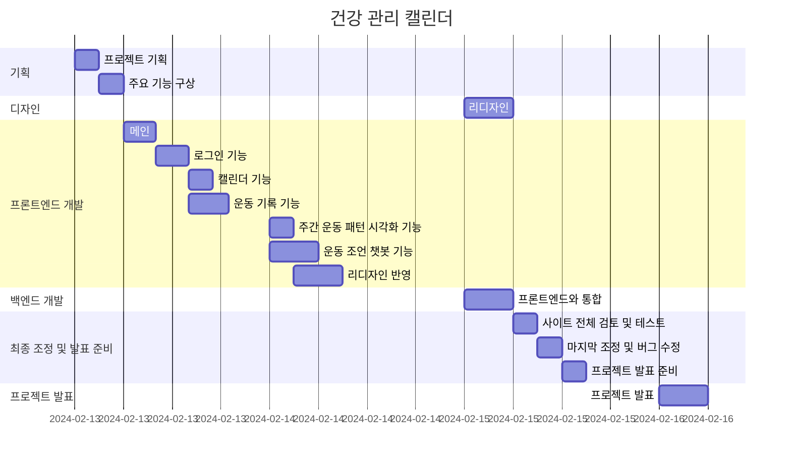

# project_1

- 챗봇을 이용한 금융 상담 프로그램

### 개발 일정(WBS)
* 아래 일정표는 머메이드로 작성했습니다.

```mermaid
gantt
    dateFormat  YYYY-MM-DD
    title       건강 관리 캘린더

    section 기획
    프로젝트 기획                    :          cal1, 2024-02-13, 3h
    주요 기능 구상                   :          cal2, after cal1, 3h

    section 디자인
    리디자인                         :          cal3, 2024-02-15, 6h

    section 프론트엔드 개발
    메인                             :         cal4, after cal2, 4h
    로그인 기능                       :         cal5, after cal4, 4h
    캘린더 기능                       :         cal6, after cal5, 3h
    운동 기록 기능                    :         cal7, after cal5, 5h
    주간 운동 패턴 시각화 기능         :         cal8, 2024-02-14, 3h
    운동 조언 챗봇 기능               :         cal9, 2024-02-14, 6h
    리디자인 반영                     :         cal10, after cal8, 6h

    section 백엔드 개발
    프론트엔드와 통합                 :          cal11, 2024-02-15, 6h

    section 최종 조정 및 발표 준비
    사이트 전체 검토 및 테스트        :         cal12, after cal11, 3h
    마지막 조정 및 버그 수정          :         cal13, after cal12, 3h
    프로젝트 발표 준비                :         cal14, after cal13, 3h

    section 프로젝트 발표
    프로젝트 발표                     :         a1, 2024-02-16, 6h
```